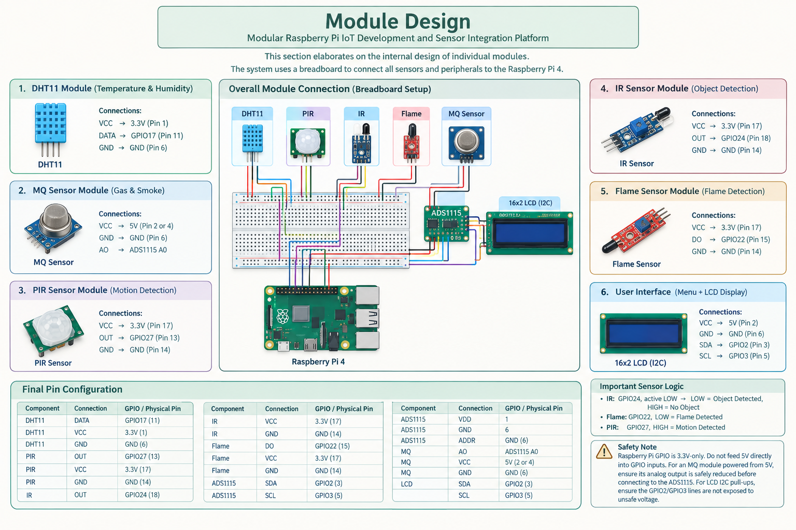

# Modular Raspberry Pi IoT Development and Sensor Integration Platform

A modular IoT sensor integration and monitoring platform developed using **Raspberry Pi 4**. The project provides a common platform for integrating multiple sensors and monitoring their readings through a simple **menu-driven interface**.

## 📌 Project Overview

IoT projects often require different sensors to be connected, tested, and monitored individually. During our project development, we observed the need for a **common and centralized platform at VSIT** where multiple IoT sensors could be integrated and monitored from a single system.

To address this, we developed the **Modular Raspberry Pi IoT Development and Sensor Integration Platform**.

The system uses a **Raspberry Pi 4 as the main controller** and provides a menu-driven interface through which users can select individual sensors and view their readings. A **Run All Sensors** option is also provided to operate all sensor modules together.

The Raspberry Pi is the central controller and is **not considered a separate sensor module**.

## 🎯 Objectives

* Develop a common platform for IoT sensor integration
* Interface multiple sensors with a Raspberry Pi 4
* Monitor sensor readings through a centralized system
* Provide a simple menu-driven interface
* Support individual sensor testing and combined operation
* Display relevant sensor information on an LCD
* Demonstrate digital and analog sensor integration
* Implement error handling and sensor cleanup

## ⚙️ System Features

* Modular sensor architecture
* Raspberry Pi 4 based control
* Menu-driven terminal interface
* Individual sensor testing
* Run All Sensors option
* LCD output
* Analog MQ sensor integration using ADS1115
* Digital sensor integration using GPIO
* Error handling
* Sensor cleanup on program exit

## 🔧 Sensor Modules

### 1. DHT11 – Temperature & Humidity

The DHT11 sensor measures:

* Temperature
* Relative humidity

**Connection:** GPIO17

### 2. MQ Sensor – Gas / Smoke Detection

The MQ sensor provides an analog output related to gas and smoke detection.

Since the Raspberry Pi does not have a built-in analog input, the MQ sensor's analog output is connected to **channel A0 of the ADS1115 ADC**.

**Connection:** MQ AO → ADS1115 A0

The ADS1115 converts the analog signal into a digital value that can be read by the Raspberry Pi.

### 3. PIR Sensor – Motion Detection

The PIR sensor detects movement in its sensing area.

**Logic:**

* HIGH → Motion Detected
* LOW → No Motion

**Connection:** GPIO27

### 4. IR Sensor – Object Detection

The IR sensor is used for object detection.

**Logic:**

* LOW → Object Detected
* HIGH → No Object

**Connection:** GPIO24

### 5. Flame Sensor – Fire Detection

The flame sensor is used to detect the presence of a flame.

**Logic:**

* LOW → Flame Detected

**Connection:** GPIO22

## 🧠 System Architecture

Raspberry Pi 4
↓
DHT11 → Temperature & Humidity
PIR → Motion Detection
IR → Object Detection
ADS1115 → MQ Sensor → Gas / Smoke
Flame Sensor → Fire Detection
LCD → System Output
Buzzer / Relay → Alert and Control

## Circuit Diagram

The following diagram shows the Raspberry Pi IoT sensor platform and its hardware connections.

## 🛠️ Hardware Components

| Component      | Purpose                                    |
| -------------- | ------------------------------------------ |
| Raspberry Pi 4 | Main controller                            |
| Breadboard     | Circuit prototyping                        |
| DHT11          | Temperature and humidity sensing           |
| MQ Sensor      | Gas and smoke sensing                      |
| PIR Sensor     | Motion detection                           |
| IR Sensor      | Object detection                           |
| Flame Sensor   | Flame detection                            |
| ADS1115 ADC    | Analog-to-digital conversion for MQ sensor |
| LCD            | Display output                             |
| Buzzer         | Alert indication                           |
| Relay          | Switching/control                          |

## 📌 Final Pin Configuration

The following is the **final pin configuration used in the project**.

| Component | Connection      | GPIO   | Physical Pin |
| --------- | --------------- | ------ | ------------ |
| DHT11     | DATA            | GPIO17 | 11           |
| DHT11     | VCC             | —      | 1            |
| DHT11     | GND             | —      | 6            |
| PIR       | OUT             | GPIO27 | 13           |
| PIR       | VCC             | —      | 17           |
| PIR       | GND             | —      | 14           |
| IR        | OUT             | GPIO24 | 18           |
| IR        | VCC             | —      | 17           |
| IR        | GND             | —      | 14           |
| Flame     | DO              | GPIO22 | 15           |
| Flame     | VCC             | —      | 17           |
| Flame     | GND             | —      | 14           |
| ADS1115   | VDD             | —      | 1            |
| ADS1115   | GND             | —      | 6            |
| ADS1115   | SDA             | GPIO2  | 3            |
| ADS1115   | SCL             | GPIO3  | 5            |
| ADS1115   | ADDR            | —      | 6            |
| MQ        | AO → ADS1115 A0 | —      | —            |
| MQ        | VCC             | —      | 2 or 4       |
| MQ        | GND             | —      | 6            |
| LCD       | VCC             | —      | 2            |
| LCD       | GND             | —      | 6            |
| LCD       | SDA             | GPIO2  | 3            |
| LCD       | SCL             | GPIO3  | 5            |

### I²C Addresses

* ADS1115 → **0x48**
* LCD → **0x27**

## 🔌 Sensor Logic

| Sensor | GPIO   | Condition | Meaning         |
| ------ | ------ | --------- | --------------- |
| PIR    | GPIO27 | HIGH      | Motion Detected |
| PIR    | GPIO27 | LOW       | No Motion       |
| IR     | GPIO24 | LOW       | Object Detected |
| IR     | GPIO24 | HIGH      | No Object       |
| Flame  | GPIO22 | LOW       | Flame Detected  |

The MQ sensor is read through the ADS1115 ADC rather than directly through a Raspberry Pi GPIO.

## 💻 Software

The project is implemented in **Python** and uses:

* time
* board
* busio
* adafruit_dht
* digitalio
* adafruit_ads1x15
* RPLCD.i2c

### Main Software Functions

* DHT11 testing
* MQ sensor testing
* PIR testing
* IR testing
* Flame sensor testing
* Run All Sensors
* LCD output
* Menu-driven terminal interface
* Error handling
* Sensor cleanup on exit

## 📋 Menu

The application provides the following menu:

1. DHT11 - Temperature & Humidity
2. MQ Sensor - Gas / Smoke
3. PIR - Motion Detection
4. IR - Object Detection
5. Flame - Fire Detection
6. Run All Sensors
0. Exit

## 🔄 Working Principle

### Step 1 — System Initialization

The Raspberry Pi initializes the connected sensors, ADS1115 ADC, LCD and required GPIO interfaces.

### Step 2 — Menu Display

The terminal displays the available sensor options.

### Step 3 — Sensor Selection

The user selects a sensor from the menu.

### Step 4 — Sensor Reading

The selected sensor is read according to its corresponding interface:

* DHT11 → Digital sensor communication
* PIR → GPIO digital input
* IR → GPIO digital input
* Flame → GPIO digital input
* MQ → Analog output → ADS1115 A0

### Step 5 — Output

The sensor reading or detection status is displayed through the terminal and relevant information can also be displayed on the LCD.

### Step 6 — Run All Sensors

The **Run All Sensors** option allows the system to read the connected sensor modules together.

### Step 7 — Exit and Cleanup

When the program exits, the connected resources and sensor interfaces are cleaned up properly.

## ⚠️ Safety Information

**Important:** Raspberry Pi GPIO pins are designed for **3.3V logic**.

* Do not connect a 5V signal directly to a Raspberry Pi GPIO input.
* The MQ module is powered from 5V, so its analog output must be safely reduced to an appropriate voltage before connecting it to the ADS1115.
* Ensure that the voltage supplied to the ADS1115 input remains within its safe operating range.
* Ensure that the LCD I²C pull-up configuration does not expose Raspberry Pi GPIO2/GPIO3 to an unsafe voltage.
* Verify wiring and power connections before switching on the Raspberry Pi.

## 📁 Repository Structure

Modular-Raspberry-Pi-IoT-Platform/

├── README.md
├── src/
│   └── main.py
├── docs/
│   ├── pin-configuration.md
│   └── system-overview.md
├── assets/
│   └── circuit-diagram.png
├── requirements.txt
└── .gitignore

## 🚀 Installation & Setup

### 1. Clone the Repository

Replace `your-username` with your GitHub username.

git clone https://github.com/your-username/Modular-Raspberry-Pi-IoT-Platform.git

### 2. Navigate to the Project

cd Modular-Raspberry-Pi-IoT-Platform

### 3. Install Required Libraries

Install the required Python packages according to the Raspberry Pi environment and the project's requirements.txt file.

pip install -r requirements.txt

### 4. Connect the Hardware

Connect the sensors and peripherals according to the **final pin configuration** documented in this repository.

### 5. Run the Program

python3 src/main.py

The menu will then be displayed in the terminal.

## 📊 Project Applications

The platform can be used as a foundation for:

* IoT sensor experimentation
* Sensor testing and demonstration
* Raspberry Pi learning
* Embedded systems projects
* Environmental monitoring prototypes
* Safety monitoring prototypes
* Academic IoT demonstrations
* Future IoT module development

Because the platform is modular, additional sensors can be integrated in the future without redesigning the entire system architecture.

## 🔮 Future Scope

Possible future improvements include:

* Addition of more sensor modules
* Web-based monitoring dashboard
* Mobile application integration
* Cloud-based data storage
* Historical sensor data logging
* Graphical visualization of sensor readings
* Automated alerts and notifications
* Remote monitoring
* Improved industrial-grade sensing

## 👥 Project Development

This project was developed as a team-based IoT project using **Raspberry Pi 4** and multiple sensor modules.

The platform focuses on creating a **centralized and modular environment for IoT sensor integration and monitoring**.

## ⭐ Project Highlights

**Raspberry Pi 4 + 5 Sensor Modules + ADS1115 ADC + LCD + Menu-Driven Interface = Modular IoT Sensor Integration Platform**
